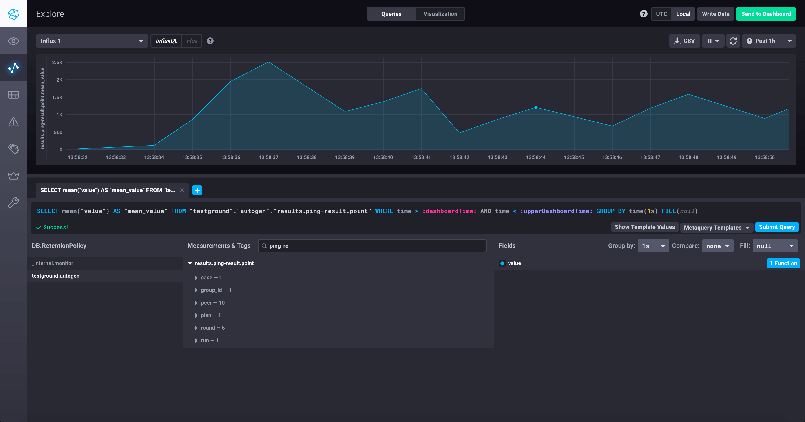

# A simple libp2p ping Testground test plan

This is a simple Testground test plan that was created for instructional purposes.
It is commented in a step-by-step didactic way to teach folks how to use Testground.

**Contents**

<!-- START doctoc generated TOC please keep comment here to allow auto update -->
<!-- DON'T EDIT THIS SECTION, INSTEAD RE-RUN doctoc TO UPDATE -->


- [About this test plan](#about-this-test-plan)
- [Installing the test plan](#installing-the-test-plan)
- [Running a single-group run with defaults](#running-a-single-group-run-with-defaults)
- [Running a single-group run with parameters](#running-a-single-group-run-with-parameters)
- [Running a composition](#running-a-composition)
- [Running with local:exec and cluster:k8s runners](#running-with-localexec-and-clusterk8s-runners)
- [License](#license)

<!-- END doctoc generated TOC please keep comment here to allow auto update -->

## About this test plan

This plan contains a single test case called `ping` (same as the plan).

This test case supports three test parameters:

* `secure_channel`: the secure channel to use. One of: `noise`, `secio`, `tls` (default: `noise`).
* `max_latency_ms`: the maximum latency to set in traffic shaping, in milliseconds (default: `1000`).
* `iterations`: the number of ping iterations to run (default: `5`).

This test case:

1. Instantiates a libp2p Host, using the instructed secure channel.
2. Connects to all other Hosts participating in the test plan.
3. Does an initial round of pings via the libp2p PING protocol, outputting the
   observed latencies as log messages and result data points. This round is not
   counted against the `iterations` param.
4. It then requests a network configuration change to set a random latency
   (up to `max_latency_ms`) on our link.
5. Once all instances have had their latencies applied, we perform a round of 
   PINGs and record the observed latencies, just like in point 3.
6. We do 4-6 as many times as `iterations`.

## Installing the test plan

First, install Testground:

```shell script
$ git clone https://github.com/testground/testground.git

$ cd testground

$ make install       # builds testground and the Docker image, used by the local:docker runner.

$ testground daemon  # will start the daemon listening on localhost:8042 by default.
# => this will run indefinitely; open a different console to continue.
```

Now, import this test plan into your `TESTGROUND_HOME` dir (by default `$HOME/testground`):

```shell script
# clone this repo in your directory of choice; let's call it `$REPO_DIR`
$ git clone https://github.com/libp2p/test-plans $REPO_DIR

# register the test plan with the testground client
$ testground plan import --from $REPO_DIR --name libp2p
created symlink $HOME/testground/plans/libp2p -> $REPO_DIR
imported plans:
libp2p/ping        ping                 (*)
libp2p/pubsub/test evaluate
libp2p/dht         find-peers
libp2p/dht         find-providers
libp2p/dht         provide-stress
libp2p/dht         store-get-value
libp2p/dht         get-closest-peers
libp2p/dht         bootstrap-network
libp2p/dht         all

# the line we've marked with (*) above indicates that the ping test plan was registered correctly.
```

## Running a single-group run with defaults

Now run the test plan and collect the results:

```shell script
# run the ping test case from the ping test plan with 10 instances, using the local:docker runner, which supports
# traffic shaping.
$ testground run single --plan=libp2p/ping --testcase=ping \
                        --builder=docker:go --runner=local:docker \
                        --instances=10 \
                        --collect

[...]

>>> Result:

Jul 22 12:31:01.675966	INFO	finished run with ID: 852eede73af1

>>> Result:

Jul 22 12:31:01.688163	INFO	created file: 852eede73af1.tgz
```

You can now inspect the collected results by opening the file.

If you want to see the metrics we recorded in InfluxDB visually, you can fire
up a Chronograf console:

```shell script
$ docker run --network testground-control -p 8888:8888 chronograf --influxdb-url=http://testground-influxdb:8086
# now open http://localhost:8888 in a browser.
```



## Running a single-group run with parameters

You can pass in test parameters via the CLI, using single runs:

```shell script
$ testground run single --plan=libp2p/ping --testcase=ping \
                        --builder=docker:go --runner=local:docker \
                        --instances=10 \
                        --test-param iterations=10 \
                        --test-param max_latency_ms=5000 \ 
                        --collect
```

## Running a composition

Compositions allow you to create more sophisticated runs, with groups of instances
built against different upstream versions, or with different test parameters, etc.

The [`high-low.toml`](_compositions/high-low.toml) bundled in this test plan performs a run
with two groups: one with low latency (max=500ms), one with high latency (max=5000ms).
Both groups have 5 instances. 

To run this composition:

```shell script
$ testground run composition -f _compositions/high-low.toml
```

## Running with local:exec and cluster:k8s runners

Via the CLI, you can pass the `--builder` and `--runner` flags to instruct which
builder and runner to use.

When using compositions, these values are part of the `[global]` section.

NOTE: the `local:exec` runner DOES NOT support traffic shaping. Therefore,
setting latencies will have a null effect (try it out, and see for yourself!).

## License

Dual-licensed: [MIT](../LICENSE-MIT), [Apache Software License v2](../LICENSE-APACHE), by way of the
[Permissive License Stack](https://protocol.ai/blog/announcing-the-permissive-license-stack/).